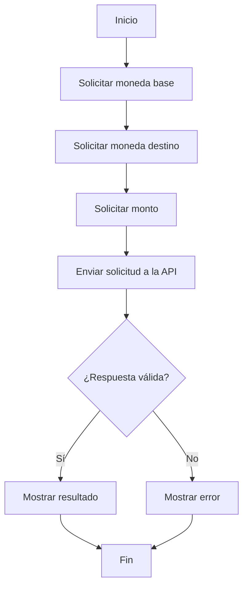

# 💱 Conversor de Monedas en Java

Este es un proyecto en Java que permite convertir un monto de una moneda a otra utilizando la API pública [ExchangeRate-API](https://www.exchangerate-api.com/). Es una aplicación de consola desarrollada con fines educativos y como parte de un portafolio personal.

## 🚀 ¿Qué hace este programa?

El usuario ingresa:
- Una moneda base (ej. USD)
- Una moneda destino (ej. MXN)
- Un monto a convertir

El programa se conecta a la API y muestra el resultado con la conversión correspondiente. También incluye un enlace para consultar las monedas disponibles.

## 📋 Requisitos

- Java 21
- Conexión a internet
- Una clave API gratuita de [ExchangeRate-API](https://www.exchangerate-api.com/)
- IntelliJ IDEA Community Edition (recomendado)

## 📦 Estructura del proyecto
```
com/rodstone/conversordemonedas/
│
├── Principal.java                         # Punto de entrada del programa
├── logica/
│   └── ConversorDeMoneda.java            # Lógica de conversión de monedas
├── modelos/
│   ├── ConversionResponse.java           # Modelo para respuesta de conversión
│   └── SupportedCodesResponse.java       # Modelo para lista de monedas
├── servicio/
│   └── ExchangeRateService.java          # Servicio que llama a la API
└── ui/
    └── InterfazUsuario.java              # Interacción con el usuario
```
## 🛠️ ¿Cómo usarlo?

1. Clona el repositorio.
2. Agrega tu clave API en `ExchangeRateService.java` reemplazando `YOUR_API_KEY`.
3. Ejecuta el programa desde `Principal.java`.
4. Sigue las instrucciones en consola.

Ejemplo de ejecución:

```bash
=== CONVERSOR DE MONEDAS ===
Ingresa el tipo de moneda base (por ejemplo USD):
> USD
Ingresa el tipo de moneda destino (por ejemplo MXN):
> EUR
Ingresa el monto a convertir:
> 100
Resultado: 100 USD equivale a 92.50 EUR
Consulta las monedas disponibles aquí:
https://v6.exchangerate-api.com/v6/YOUR_API_KEY/codes
```
## 📈 Diagrama de flujo (Mermaid)


## 🔐 Protección de datos

La clave API se encuentra escrita en el código como una constante. Para producción o publicación, se recomienda:
- Usar variables de entorno.
- Agregar `*.key` o `*.env` al archivo `.gitignore`.

## 🧠 Mejoras futuras

- Mostrar las monedas disponibles como JSON ordenado y legible.
- Validar que los tipos de moneda ingresados por el usuario sean válidos.
- Separar y ocultar la clave API con mecanismos seguros (por ejemplo, `.env`).

## 📄 Licencia

Este proyecto está bajo la Licencia MIT. Puedes usarlo libremente con fines educativos y personales. Consulta el archivo [LICENSE](LICENSE) para más información.